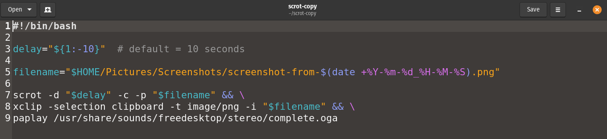

# scrot-copy

A simple Bash script that:

- Takes a delayed screenshot using scrot
- Has customizable delay argument
- Includes the mouse cursor
- Saves the screenshot with a timestamp (timestamped filenames can be customized in the script)
- Automatically copies the screenshot to the clipboard using xclip
- Plays a notification sound when complete



---
## Requirements

- scrot
- xclip
- paplay (usually included with PulseAudio/PipeWire setups)

---
## Usage

Default 10-second delay:

```bash
scrot-copy
```

Custom delay (example: 5 seconds):

```bash
scrot-copy 5
```

---
## Installation

Copy the script into:

```bash
~/bin/
```

Make it executable:

```bash
chmod +x ~/bin/scrot-copy
```

Make sure `~/bin` is in your PATH.

---
## Tested On

- `Pop!_OS` 22.04 LTS
- Built around scrot 1.7-1 from Ubuntu/`Pop!_OS` repositories
- X11

---
## Note

Newer versions of Scrot may already include an audible notification after capture.

This script was created and tested with Scrot 1.7-1 on `Pop!_OS`, and additionally provides clipboard integration and customizable delays.

---
## Why does this exist?

One thing I discovered is that:
- GNOME Screenshot had a cursor issue.
- Flameshot didn't capture the cursor.

I wanted a lightweight screenshot workflow that:

- captures the mouse cursor
- supports delayed (timer) screenshots with customizable delay
- copies directly to the clipboard
- provides audible feedback when the capture completes

This script was created to solve that workflow on Linux.